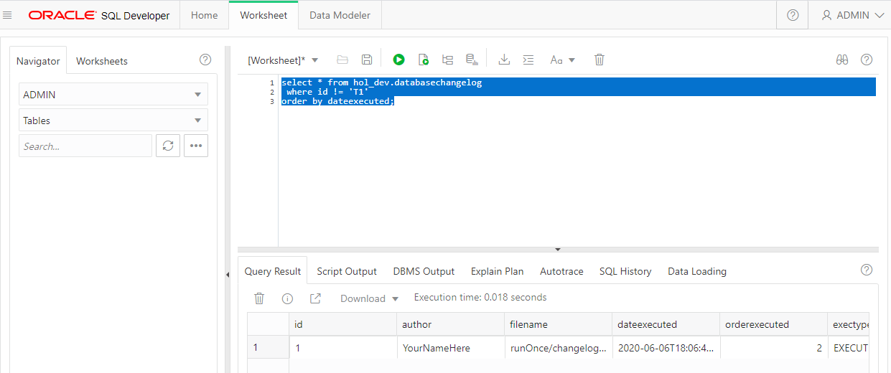

# Liquibase
[Liquibase](https://github.com/liquibase/liquibase) is a [schema migration](https://en.wikipedia.org/wiki/Schema_migration) tool that you will use to create and modify the objects in your database.

The below code examples will be run in your **Cloud Shell(ssh)** unless otherwise noted.

## A little setup
You could run liquibase from the command line with a `java -jar` command using parameters.  To make it a bit easier, Liquibase includes a shell script and a .bat file that you can call `/opt/liquibase/liquibase`.  When you installed liquibase you added the directory to your the path for your opc user.  This will allow you to simply call `liquibase` in the below examples.

Try it in your **Cloud Shell(ssh)**
```
liquibase --version
```

Switch into the Liquibase directory.

```
cd /home/opc/db-devops-tools/liquibase
```

You could pass all of the required information to Liquibase with parameters each time you run it, or you can make it easier by creating a `liquibase.properties` file.

```
nano liquibase.properties
```
Add the following values.  Correct the password if you have changed it.
```yaml
changeLogFile: master.json
url: jdbc:oracle:thin:@MyAtpDb_tp?TNS_ADMIN=/opt/oracle/wallet
username: hol_dev
password: HandsOnLabUser1
classpath: /opt/oracle/ojdbc8.jar
```
Now, when you run liquibase from this directory, it will use the above information to make the connection and run the changeLogFile.

You can always override one or more of these values with a command line parameter.  For example, if you wanted to connect as the hol_test user you would use the parameter ```--username=hol_test``.  

### [Changelogs](https://docs.liquibase.com/concepts/basic/changelog.html?Highlight=changelog)
A changelog is a file that contains a list of changes to be made.  They can be written in many formats including JSON, XML, SQL, YAML and others.  For these exercises you will be using JSON.

Create a changelog file runOnce/changelog-create-customers.json
```
nano runOnce/changelog-create-customers.json
```
Add the following to the file
```json
{
  "databaseChangeLog": [
    {
      "preConditions": [
        {
          "or": [
            {
              "runningAs": {
                "username": "HOL_DEV"
              }
            },
            {
              "runningAs": {
                "username": "HOL_TEST"
              }
            }
          ]
        }
      ]
    },
    {
      "changeSet": {
        "id": "1",
        "author": "YourNameHere",
        "comment": "Add table customers",
        "changes": [
          {
            "createTable": {
              "tableName": "customers",
              "columns": [
                {
                  "column": {
                    "name": "id",
                    "type": "int",
                    "autoIncrement": true,
                    "constraints": {
                      "primaryKeyName": "customers_pk",
                      "primaryKey": true
                    }
                  }
                },
                {
                  "column": {
                    "name": "email",
                    "type": "varchar(200)",
                    "constraints": {
                      "uniqueConstraintName": "customers_email_uk",
                      "unique": true
                    }
                  }
                }
              ]
            }
          }
        ]
      }
    }
  ]
}
```
This changelog includes the following elements:
* [Preconditions](https://docs.liquibase.com/concepts/advanced/preconditions.html) are checks that will be evaluated before the changes are executed.  In this changelog you are ensuring that the changes will only be executed if you are either connected as `hol_dev` or `hol_test`.
* A [changeset] is a group of changes.  The id value can be any string that makes sense for your project.  The author value should be changed to your name.
* The changes array can contain one or more [Change Types](https://docs.liquibase.com/change-types/home.html).  In this changelog you will be creating a table.  As you read through the JSON object it may sound similar to how you would write an SQL script.

### Changelog Master file
The master.json file is a changelog file that defines the run order for the other changelogs.  Instead of a master, you could start with a single changelog and chain all of your changelogs together.  If you were to do this, it would get complicated very fast.  Using a master changelog is a [better practice](https://docs.liquibase.com/concepts/bestpractices.html).

Modify the file master.json
```
nano master.json
```
Modify the file to include the new changelog.

```json
{
  "databaseChangeLog": [
    {
      "include": {
        "file": "runOnChange/changelog-test_gen_cust-pkg.json"
      }
    },
    {
      "include": {
        "file": "runOnce/changelog-create-customers.json"
      }
    }
  ]
}
```
## First Changelog
### Generate SQL
Most of the liquibase commands can be run with the `SQL` postfix.  This will output the generated SQL instead of actually updating the database.  

This can be useful for the times when you simply want to do a sanity check, or if you want to generate .sql files.

Run the following to generate SQL for your new changelog.
```
liquibase updateSQL
```

Ignore the `test_generate_customers_func` package code for now, that will be covered in the utPLSQL section.

At the bottom of the output you should see the following
```
-- Changeset runOnce/changelog-create-customers.json::1::YourNameHere
-- Add table customers
CREATE TABLE customers (id INTEGER GENERATED BY DEFAULT AS IDENTITY NOT NULL, email VARCHAR2(200), CONSTRAINT customers_pk PRIMARY KEY (id), CONSTRAINT customers_email_uk UNIQUE (email));
```

You will see other SQL statements in the output referencing the tables `DATABASECHANGELOGLOCK` and `DATABASECHANGELOG`, these tables are used by Liquibase to control and record the changes to your schema.

Run the changes on your Database
```
liquibase update
```
You should see `Liquibase: Update has been successful.` if everything ran correctly.

Run the following query in a **SQL Developer Web** worksheet.
```sql
select * from hol_dev.databasechangelog
 where id != 'T1'
order by dateexecuted;
```  
  

Scroll through the row data to see what Liquibase tracks about the changesets.  Notice towards the end that `tag` is `(null)`.

## Tags
Tagging your changeset is can be useful in many ways.  In the following exercises you will use tags as a point to rollback to.

You can tag a changeset in a couple different ways.

### From the command line
Run the following in your **Cloud Shell(ssh)**
```
liquibase tag One
```

Run the following query in a **SQL Developer Web** worksheet.
```sql
select id, author, dateexecuted, tag
  from hol_dev.databasechangelog
 where id != 'T1'
order by dateexecuted;
```
tag is now `One`

### Tag from the changeset
You can add a tag to a changelog with the following
```json
      "tagDatabase": {
        "tag": "<YourTagGoesHere>"
      },
```

Create a new changelog

Run the following in your **Cloud Shell(ssh)** 
```
nano runOnce/changelog-create-orders.json
```
Add the following to the file.  
```json
{
  "databaseChangeLog": [
    {
      "preConditions": [
        {
          "or": [
            {
              "runningAs": {
                "username": "HOL_DEV"
              }
            },
            {
              "runningAs": {
                "username": "HOL_TEST"
              }
            }
          ]
        }
      ]
    },
    {
      "changeSet": {
        "id": "2",
        "author": "YourNameHere",
        "comment": "Add table orders",
        "tagDatabase": {
          "tag": "NotTwo"
        },
        "changes": [
          {
            "createTable": {
              "tableName": "orders",
              "columns": [
                {
                  "column": {
                    "name": "id",
                    "type": "int",
                    "autoIncrement": true,
                    "constraints": {
                      "primaryKey": true,
                      "primaryKeyName": "orders_pk"
                    }
                  }
                },
                {
                  "column": {
                    "name": "order_datetime",
                    "type": "timestamp",
                    "defaultValueComputed": "CURRENT_TIMESTAMP",
                    "constraints": {
                      "nullable": false
                    }
                  }
                },
                {
                  "column": {
                    "name": "customer_id",
                    "type": "int",
                    "constraints": {
                      "nullable": false,
                      "foreignKeyName": "orders_customer_id_fk",
                      "references": "CUSTOMERS(id)"
                    }
                  }
                },
                {
                  "column": {
                    "name": "order_status",
                    "type": "varchar2(10)",
                    "constraints": {
                      "nullable": false
                    }
                  }
                }
              ]
            }
          }
        ]
      }
    }
  ]
}
```
Notice the `"tag": "NotTwo"` property.

Add this new changelog to the file master.json
```
nano master.json
```
Modify the file to include the new changelog.

```json
{
  "databaseChangeLog": [
    {
      "include": {
        "file": "runOnChange/changelog-test_gen_cust-pkg.json"
      }
    },
    {
      "include": {
        "file": "runOnce/changelog-create-customers.json"
      }
    },
    {
      "include": {
        "file": "runOnce/changelog-create-orders.json"
      }
    }
  ]
}
```

Run the changes
```
liquibase update
```

Run the following query in a **SQL Developer Web** worksheet.
```sql
select id, author, dateexecuted, tag
  from hol_dev.databasechangelog
 where id != 'T1'
order by dateexecuted;
```
Changeset 2 has a tag of `NotTwo`

Run the following in your **Cloud Shell(ssh)**
```
liquibase tag Two
```

Run the following query in a **SQL Developer Web** worksheet.
```sql
select id, author, dateexecuted, tag
  from hol_dev.databasechangelog
 where id != 'T1'
order by dateexecuted;
```
Changeset 2 now has a tag of `Two`

Note: A changeset will only have a single tag. When you use the `liquibase tag` command, it will overwrite the tag of the last changeset run.

## Schema Diff
Your database has been setup with two schemas, hol_dev and hol_test.  Running `liquibase update` in your **Cloud Shell(ssh)** with the current `liquibase.properties` will update hol_dev. Your Jenkins build has been setup to update hol_test.  Your Jenkins build will be triggered whenever your code is pushed to GitHub.


Run the following query in a **SQL Developer Web** worksheet to show the existing tables in hol_dev and hol_test.
```sql
select owner, table_name
  from all_tables
 where owner in ('HOL_DEV', 'HOL_TEST')
order by 1,2;
```
As you can see, tables have been created in hol_dev and not hol_test.

You can also use the `liquibase diff` to compare schemas by passing in a 'reference Url'.

Run the following in your **Cloud Shell(ssh)**
```
liquibase --referenceUrl="jdbc:oracle:thin:hol_test/HandsOnLabUser1@MyAtpDb_tp?TNS_ADMIN=/opt/oracle/wallet" diff
```
If you plan to use the 'diff' command a lot, you can add the reference values to the liquibase.properties file

```
nano liquibase.properties
```
Add reference db connection information
```yaml
referenceUrl: jdbc:oracle:thin:@MyAtpDb_tp?TNS_ADMIN=/opt/oracle/wallet
referenceUsername: hol_test
referencePassword: HandsOnLabUser1
```
You can also filter the diff report to specific diffTypes.

```
liquibase --diffTypes=tables,columns diff
```
The 'reference' schema is considered to be the 'known good' schema.  Since it is empty and your hol_dev schema contains objects they are listed as 'unexpected' in the report.

### Generate diffChangeLog
You can use the `diffChangeLog` command to compare your current schema to a "known good" and auto-generate a changelog.  You could use this changelog to sync your current schema with the reference schema.  
**Do not run this changelog, it is only an example**
```
liquibase --changeLogFile=diff-changelog.json diffChangeLog
cat diff-changelog.json
rm diff-changelog.json
```

### Push your changes to GitHub
This should trigger the webhook and test the Jenkins integration.

```bash
cd ~/db-devops-tools
git status
git add .
git commit -m"Added customers and orders tables."
git push
cd liquibase
```
Switch to your Jenkins browser tab and make sure the build does not error.  Once the build is complete, run the diff command again.

Run the following in your **Cloud Shell(ssh)**
```
liquibase diff
```

Your two schema should be the same.

## Rollback

### Add a column
When you make changes to existing objects you will create a new changelog.  You **do not** alter the previous changelogs.

```
nano runOnce/changelog-add-col-customers-name.json
```
Add the following to the file
```json
{
  "databaseChangeLog": [
    {
      "preConditions": [
        {
          "or": [
            {
              "runningAs": {
                "username": "HOL_DEV"
              }
            },
            {
              "runningAs": {
                "username": "HOL_TEST"
              }
            }
          ]
        }
      ]
    },
    {
      "changeSet": {
        "id": "3",
        "author": "YourNameHere",
        "comment": "Add name column to customers table",
        "tagDatabase": {
          "tag": "Three"
        },
        "changes": [
          {
            "addColumn": {
              "tableName": "customers",
              "columns": [
                {
                  "column": {
                    "name": "name",
                    "type": "varchar(255)"
                  }
                }
              ]
            }
          }
        ]
      }
    }
  ]
}
```
Add the new change log to the bottom of the file master.json
```
nano master.json
```

Modify the file to include the new changelog.

```json
{
  "databaseChangeLog": [
    {
      "include": {
        "file": "runOnChange/changelog-test_gen_cust-pkg.json"
      }
    },
    {
      "include": {
        "file": "runOnce/changelog-create-customers.json"
      }
    },
    {
      "include": {
        "file": "runOnce/changelog-create-orders.json"
      }
    },
    {
      "include": {
        "file": "runOnce/changelog-add-col-customers-name.json"
      }
    }
  ]
}
```

Run the updat
```
liquibase update
```

Run the following in **SQL Developer Web**
```
desc hol_dev.customers
```

### The customer name column should be required.  
The customer name column is missing a not null constraint.  
You could create another changeset and run it, or if you're sure no one else is currently working on this table, you could do a quick rollback, fix it and re-run the change.

### Rollback one changeset

Run the following in your **Cloud Shell(ssh)**
```
liquibase rollbackCount 1
```

Run the following in **SQL Developer Web**
```
desc hol_dev.customers
```  

Run the following in your **Cloud Shell(ssh)**
```
nano runOnce/changelog-add-col-customers-name.json
```
Add a `"nullable": false` constraint to the column.
```json
...
                {
                  "column": {
                    "name": "name",
                    "type": "varchar(255)",
                    "constraints": {
                      "nullable": false
                    }
                  }
                }
...
```
Re-run the update.
```
liquibase update
```

Run the following in **SQL Developer Web**
```
desc hol_dev.customers
```  


It can be risky to rollback X number of changesets.  If you count incorrectly or if someone else has run an update that your are unaware of.

It is safer to
### Rollback to a tag

Run the following query in a **SQL Developer Web** worksheet.
```sql
select id, author, dateexecuted, tag
  from hol_dev.databasechangelog
 where id != 'T1'
order by dateexecuted;
```

You should see 3 changesets tagged 'One', 'Two' and 'Three'

Run the following in your **Cloud Shell(ssh)**
```
liquibase rollback "Two"
```

Run the following query in a **SQL Developer Web** worksheet.
```sql
select id, author, dateexecuted, tag
  from hol_dev.databasechangelog
 where id != 'T1'
order by dateexecuted;
```

You should see 2 changesets tagged 'One' and 'Two'

When you rollback to a tag it will look backwards from the most recent changeset and locate the newest instance of the tag.  Liquibase will rollback the changes that came after that tag but keep the tagged changeset.

Re-run the changes in your **Cloud Shell(ssh)**
```
liquibase update
```

Push your changes to GitHub
```bash
cd ~/db-devops-tools
git status
git add .
git commit -m"Added customer name column."
git push
cd liquibase
```

Switch to your Jenkins tab in your browser and make sure the build does not error.  Once the build is complete, run the diff command again.
```
liquibase diff
```

There should be no differences.

## Multiple changes in a set
Making a singe change in each changeset is the [recommended practice](https://docs.liquibase.com/concepts/bestpractices.html).  However, sometimes it does make sense to include multiple changes.

Run the following in your **Cloud Shell(ssh)**
```
nano runOnce/changelog-create-order-statuses.json
```
Add the following to the file
```json
{
  "databaseChangeLog": [
    {
      "preConditions": [
        {
          "or": [
            {
              "runningAs": {
                "username": "HOL_DEV"
              }
            },
            {
              "runningAs": {
                "username": "HOL_TEST"
              }
            }
          ]
        }
      ]
    },
    {
      "changeSet": {
        "id": "4",
        "author": "YourNameHere",
        "comment": "Create Order_Statuses table",
        "tagDatabase": {
          "tag": "Four"
        },
        "changes": [
          {
            "createTable": {
              "tableName": "order_statuses",
              "columns": [
                {
                  "column": {
                    "name": "status",
                    "type": "varchar(10)",
                    "constraints": {
                      "primaryKeyName": "order_statuses_pk",
                      "primaryKey": true
                    }
                  }
                },
                {
                  "column": {
                    "name": "description",
                    "type": "varchar(255)"
                  }
                }
              ]
            }
          },
          {
            "addForeignKeyConstraint": {
              "baseColumnNames": "order_status",
              "baseTableName": "orders",
              "constraintName": "order_status_fk",
              "referencedColumnNames": "status",
              "referencedTableName": "order_statuses",
              "validate": true
            }
          }
        ]
      }
    }
  ]
}
```
In this changeset you are creating a new table **and** creating a foreign key on one of the columns.

Add the new change log to the bottom of the file master.json
```
nano master.json
```

Modify the file to include the new changelog.

```json
{
  "databaseChangeLog": [
    {
      "include": {
        "file": "runOnChange/changelog-test_gen_cust-pkg.json"
      }
    },
    {
      "include": {
        "file": "runOnce/changelog-create-customers.json"
      }
    },
    {
      "include": {
        "file": "runOnce/changelog-create-orders.json"
      }
    },
    {
      "include": {
        "file": "runOnce/changelog-add-col-customers-name.json"
      }
    },
    {
      "include": {
        "file": "runOnce/changelog-create-order-statuses.json"
      }
    }
  ]
}
```

Run the changes
```
liquibase update
```

Run the following queries in **SQL Developer Web**
```
select owner,object_name, object_type from all_objects where object_name = 'ORDER_STATUSES';


select constraint_name, table_name, r_constraint_name from all_constraints where constraint_name ='ORDER_STATUS_FK';
```

## Load Data
Order_status is a master table and should come pre-loaded with data.  An easy way to load the data is using a

### .csv file

Run the following in your **Cloud Shell(ssh)**
```
nano runOnce/status-data.csv
```
Add the following
```
status,description
New,Still being created
Submitted,Awaiting payment
Shipped,as been sent
Complete,Has been delivered
```
The first row defines the columns that data will be loaded into.  The remain rows contain the data to be loaded.

Create a new changelog
```
nano runOnce/changelog-load-status-data.json
```
Add the following
```json
{
  "databaseChangeLog": [
    {
      "preConditions": [
        {
          "or": [
            {
              "runningAs": {
                "username": "HOL_DEV"
              }
            },
            {
              "runningAs": {
                "username": "HOL_TEST"
              }
            }
          ]
        }
      ]
    },
    {
      "changeSet": {
        "id": "5",
        "author": "YourNameHere",
        "comment": "Load Order_Statuses data",
        "tagDatabase": {
          "tag": "Five"
        },
        "changes": [
          {
            "loadData": {
              "tableName": "order_statuses",
              "file": "runOnce/status-data.csv"
            }
          }
        ]
      }
    }
  ]
}
```

Add the new change log to the bottom of the file master.json
```
nano master.json
```

Modify the file to include the new changelog.

```json
{
  "databaseChangeLog": [
    {
      "include": {
        "file": "runOnChange/changelog-test_gen_cust-pkg.json"
      }
    },
    {
      "include": {
        "file": "runOnce/changelog-create-customers.json"
      }
    },
    {
      "include": {
        "file": "runOnce/changelog-create-orders.json"
      }
    },
    {
      "include": {
        "file": "runOnce/changelog-add-col-customers-name.json"
      }
    },
    {
      "include": {
        "file": "runOnce/changelog-create-order-statuses.json"
      }
    },
    {
      "include": {
        "file": "runOnce/changelog-load-status-data.json"
      }
    }
  ]
}
```

Run the following queries in **SQL Developer Web**
```sql
select * from hol_dev.order_statuses;
```
There should be no data in the table.

Run the update
```
liquibase update
```

Run the following queries in **SQL Developer Web**
```sql
select * from hol_dev.order_statuses;
```
The 4 statuses have been loaded.

### Fix a typo.
There is a typo in the Shipped description "as been sent"  

Try to roll back the change.

Run the following in your **Cloud Shell(ssh)**
```
liquibase rollback Four
```
You will receive an error.
```
...
Unexpected error running Liquibase: No inverse to liquibase.change.core.LoadDataChange created
...
```

Certain changes can not be automatically [rolled back](https://docs.liquibase.com/workflows/liquibase-community/using-rollback.html?Highlight=rollback) such as
Data changes, drop tables and pl/sql objects.

### Add rollback section

Run the following in your **Cloud Shell(ssh)**
```
nano runOnce/changelog-load-status-data.json
```
Add the following at the end of the changes array
```json
,
          {
            "rollback": {
              "delete": {
                "tableName": "order_statuses"
              }
            }
          }
```
Rollback the change
```
liquibase rollback Four
```

Fix the data
```
nano runOnce/status-data.csv
```
Add the 'H'
```
...
Shipped,Has been sent
...
```
Run the corrected change
```
liquibase update
```

Run the following queries in **SQL Developer Web**
```sql
select * from hol_dev.order_statuses;
```
The data is correct.

Push your changes to GitHub

Run the following in your **Cloud Shell(ssh)**
```bash
cd ~/db-devops-tools
git status
git add .
git commit -m"Added order status data."
git push
cd liquibase
```
Switch to your Jenkins tab in your browser and make sure the build does not error.  Once the build is complete, check the hol_test data in SDW.  
**Data differences are not shown in the diff results.**

Run the following queries in **SQL Developer Web**
```sql
select * from hol_test.order_statuses;
```
The data is correct.

### Load Test data - [Context](https://docs.liquibase.com/concepts/advanced/contexts.html)

You can use contexts to control which changesets will be include in an update.

Modify liquibase.properties  

Run the following in your **Cloud Shell(ssh)**
```
nano liquibase.properties
```
Add the following at the bottom
```yaml
contexts: !test
```

Create a new changelog
```
nano runOnce/changelog-load-test-data.json
```
Add the following to the file
```json
{
  "databaseChangeLog": [
    {
      "preConditions": [
        {
          "or": [
            {
              "runningAs": {
                "username": "HOL_DEV"
              }
            },
            {
              "runningAs": {
                "username": "HOL_TEST"
              }
            }
          ]
        }
      ]
    },
    {
      "changeSet": {
        "id": "6",
        "author": "YourNameHere",
        "comment": "Load Test Data",
        "tagDatabase": {
          "tag": "Six"
        },
        "context": "test",
        "changes": [
          {
            "insert": {
              "tableName": "customers",
              "columns": [
                {
                  "column": {
                    "name": "email",
                    "value": "Betty@example.com"
                  }
                },
                {
                  "column": {
                    "name": "name",
                    "value": "Betty"
                  }
                }
              ]
            }
          },
          {
            "insert": {
              "tableName": "customers",
              "columns": [
                {
                  "column": {
                    "name": "email",
                    "value": "Bob@example.com"
                  }
                },
                {
                  "column": {
                    "name": "name",
                    "value": "Bob"
                  }
                }
              ]
            }
          },
          {
            "insert": {
              "tableName": "orders",
              "columns": [
                {
                  "column": {
                    "name": "customer_id",
                    "valueComputed": "(SELECT id FROM customers where name = 'Betty')"
                  }
                },
                {
                  "column": {
                    "name": "order_status",
                    "value": "New"
                  }
                }
              ]
            }
          },
          {
            "insert": {
              "tableName": "orders",
              "columns": [
                {
                  "column": {
                    "name": "customer_id",
                    "valueComputed": "(SELECT id FROM customers where name = 'Bob')"
                  }
                },
                {
                  "column": {
                    "name": "order_status",
                    "value": "Submitted"
                  }
                }
              ]
            }
          },
          {
            "rollback": {
              "delete": {
                "tableName": "orders"
              }
            }
          },
          {
            "rollback": {
              "delete": {
                "tableName": "customers"
              }
            }
          }
        ]
      }
    }
  ]
}
```
In this changelog you are using the insert change to add data to the customer and orders tables.

When data is added to the customer table the ID is generated automatically.  Since this new ID could be any number, you can not define it with a 'value' object when you add an order record.

The insert object can use a `valueComputed` property to run a query at runtime to retrieve the value of the customer id.  (Of course, you need to make sure your query only returns a single value.)

```
"valueComputed": "(SELECT id FROM customers where name = 'Bob')"
```

Add the new change log to the bottom of the file master.json
```
nano master.json
```

Modify the file to include the new changelog.

```json
{
  "databaseChangeLog": [
    {
      "include": {
        "file": "runOnChange/changelog-test_gen_cust-pkg.json"
      }
    },
    {
      "include": {
        "file": "runOnce/changelog-create-customers.json"
      }
    },
    {
      "include": {
        "file": "runOnce/changelog-create-orders.json"
      }
    },
    {
      "include": {
        "file": "runOnce/changelog-add-col-customers-name.json"
      }
    },
    {
      "include": {
        "file": "runOnce/changelog-create-order-statuses.json"
      }
    },
    {
      "include": {
        "file": "runOnce/changelog-load-status-data.json"
      }
    },
    {
      "include": {
        "file": "runOnce/changelog-load-test-data.json"
      }
    }
  ]
}
```
Run an update
```
liquibase update
```
Run the following queries in **SQL Developer Web**
```sql
select * from hol_dev.customers;

select * from hol_dev.orders;
```
No data was loaded.  

Contexts will only be evaluated if you specifically include a rule to process them.

In this case, adding `contexts: !test` to the liquibase.properties file instructed Liquibase to **not** run any changesets with a 'test' context.

Run the following in your **Cloud Shell(ssh)**
```
liquibase --contexts="test" update
```

Re-run the following queries in **SQL Developer Web**
```sql
select * from hol_dev.customers;

select * from hol_dev.orders;
```
This time the data was loaded.

Remember, command line options such as `--contexts="test"` will override the same setting in the liquibase.properties file.  In this case it instructs liquibase to include the 'test' changes.

To rollback this changeset you also need to use --contexts="test".
```
liquibase --contexts="test" rollback Five
```

Re-run the following queries in **SQL Developer Web**
```sql
select * from hol_dev.customers;

select * from hol_dev.orders;
```
The test data has been removed.

## Run on Change
Some database objects are created using the "Create or Replace" syntax such as Views and PL/SQL objects (Functions, Procedures, Packages and Triggers).  
It is a good practice to maintain the source for these objects directly in your VCS and have liquibase "re-compile" them whenever they change.

Create a new changelog

Run the following in your **Cloud Shell(ssh)**
```
nano runOnChange/changelog-status-view.json
```
Add the following
```json
{
  "databaseChangeLog": [
    {
      "preConditions": [
        {
          "or": [
            {
              "runningAs": {
                "username": "HOL_DEV"
              }
            },
            {
              "runningAs": {
                "username": "HOL_TEST"
              }
            }
          ]
        }
      ]
    },
    {
      "changeSet": {
        "id": "7",
        "author": "YourNameHere",
        "comment": "Create or replace status view",
        "tagDatabase": {
          "tag": "Seven"
        },
        "runOnChange": true,
        "changes": [
          {
            "createView": {
              "fullDefinition": true,
              "selectQuery": "create or replace view status as select status order_status from order_statuses",
              "viewName": "DD_DEQUEUE_ERRORS"
            }
          }
        ],
        "rollback": ""
      }
    }
  ]
}
```
The `"runOnChange": true,` property will instruct Liquibase to monitor this changelog and re-run it anytime it has changed.

Add this new changelog to the file master.json
```
nano master.json
```
Modify the file to include the new changelog.

```json
{
  "databaseChangeLog": [
    {
      "include": {
        "file": "runOnChange/changelog-test_gen_cust-pkg.json"
      }
    },
    {
      "include": {
        "file": "runOnce/changelog-create-customers.json"
      }
    },
    {
      "include": {
        "file": "runOnce/changelog-create-orders.json"
      }
    },
    {
      "include": {
        "file": "runOnce/changelog-add-col-customers-name.json"
      }
    },
    {
      "include": {
        "file": "runOnce/changelog-create-order-statuses.json"
      }
    },
    {
      "include": {
        "file": "runOnce/changelog-load-status-data.json"
      }
    },
    {
      "include": {
        "file": "runOnce/changelog-load-test-data.json"
      }
    },
    {
      "include": {
        "file": "runOnChange/changelog-status-view.json"
      }
    }
  ]
}
```
Run the update
```
liquibase update
```

Run the following queries in **SQL Developer Web**
```sql
select * from hol_dev.status;
```

Look at Liquibase Data
```sql
select *
  from hol_dev.databasechangelog
 where id='7'
order by dateexecuted;
```
Notice the dateexecuted timestamp.

Edit the view SQL in the changelog

Run the following in your **Cloud Shell(ssh)**

```
nano runOnChange/changelog-status-view.json
```
Change the SQL in "selectQuery" to the following.

```
              "selectQuery": "create or replace view status as select status order_status, description from order_statuses",
```
Run the update
```
liquibase update
```

Run the following queries in **SQL Developer Web**
```sql
select * from hol_dev.status;
```
The view now executes the new query.

Look at Liquibase Data
```sql
select *
  from hol_dev.databasechangelog
 where id='7'
order by dateexecuted;
```
Notice the dateexecuted timestamp has changed.

### PL/SQL files
Create a new changelog

Run the following in your **Cloud Shell(ssh)**
```
nano runOnChange/changelog-gen_cust-fnc.json
```
Add the following
```json
{
  "databaseChangeLog": [
    {
      "preConditions": [
        {
          "or": [
            {
              "runningAs": {
                "username": "HOL_DEV"
              }
            },
            {
              "runningAs": {
                "username": "HOL_TEST"
              }
            }
          ]
        }
      ]
    },
    {
      "changeSet": {
        "id": "8",
        "author": "YourNameHere",
        "comment": "Create or replace generate customers function",
        "tagDatabase": {
          "tag": "Eight"
        },
        "runOnChange": true,
        "changes": [
          {
            "createProcedure": {
              "dbms": "oracle",
              "encoding": "utf8",
              "path": "../source/gen_cust.fnc",
              "relativeToChangelogFile": true
            }
          }
        ],
        "rollback": ""
      }
    }
  ]
}
```

Notice this changelog references a file in the "path" value and that this file path is relative to the changelog file.
```
              "path": "gen_cust.fnc",
              "relativeToChangelogFile": true
```

Add this new changelog to the file master.json
```
nano master.json
```
Modify the file to include the new changelog.

```json
{
  "databaseChangeLog": [
    {
      "include": {
        "file": "runOnChange/changelog-test_gen_cust-pkg.json"
      }
    },
    {
      "include": {
        "file": "runOnce/changelog-create-customers.json"
      }
    },
    {
      "include": {
        "file": "runOnce/changelog-create-orders.json"
      }
    },
    {
      "include": {
        "file": "runOnce/changelog-add-col-customers-name.json"
      }
    },
    {
      "include": {
        "file": "runOnce/changelog-create-order-statuses.json"
      }
    },
    {
      "include": {
        "file": "runOnce/changelog-load-status-data.json"
      }
    },
    {
      "include": {
        "file": "runOnce/changelog-load-test-data.json"
      }
    },
    {
      "include": {
        "file": "runOnChange/changelog-status-view.json"
      }
    },
    {
      "include": {
        "file": "runOnChange/changelog-gen_cust-fnc.json"
      }
    }
  ]
}
```
Run the update
```
liquibase update
```

Run the following queries in **SQL Developer Web**
```sql
select *
  from hol_dev.databasechangelog
 where id='8'
```
Notice the dateexecuted timestamp.

Modify the function

Run the following in your **Cloud Shell(ssh)**
```
nano ../source/gen_cust.fnc
```

Change the Max customer constant to 25.
```
c_max_customers   CONSTANT INTEGER := 25;
```

Run the update
```
liquibase update
```

Run the following queries in **SQL Developer Web**
```sql
select *
  from hol_dev.databasechangelog
 where id='8'
```
Notice the dateexecuted timestamp has changed.

A changelog flagged `"runOnChange": true,` will re-run whenever the changelog itself is changed or the file it's referencing has changed.  

Push your changes to GitHub
```bash
cd ~/db-devops-tools
git status
git add .
git commit -m"Added a view and function."
git push
cd liquibase
```
Switch to your Jenkins tab in your browser and make sure the build does not error.  Once the build is complete, check the hol_test data in SDW.  

Run the following queries in **SQL Developer Web**
```sql
select * from hol_test.customers;

select * from hol_test.orders;
```

## Reverse engineer your current schema
Liquibase uses the `generateChangeLog` command to reverse engineer your current schema into a changelog.

Run the following in your **Cloud Shell(ssh)**
```
liquibase --changeLogFile=generated.json generateChangeLog
cat generated.json
```
It is a good idea to review any code that is generated automatically by a tool.  You will want to verify that everything is good before you use the generated changelog.

If you were going to use the generated code it would be a good idea to break it into smaller changelogs to make it easier to troubleshoot.

## Drop All

Run the following in your **Cloud Shell(ssh)**
```
liquibase dropAll
```
This is one of those commands that you need to be careful with.  

Run the following queries in **SQL Developer Web**
```sql
select owner, table_name
  from all_tables
 where owner in ('HOL_DEV', 'HOL_TEST')
order by 1,2;
```

Notice that all of the tables in HOL_DEV have been dropped.  
This command will drop all of your schema tables even if they were not created by Liquibase.  

## Generate Docs
Liquibase includes the ability to [generate documentation](https://docs.liquibase.com/workflows/liquibase-community/generating-docs.html) for your database.

Run the following in your **Cloud Shell(ssh)**
```
liquibase DBDoc docs
ls -la docs
```

Use the following command to start a simple HTTP server with Python.
```
pushd /home/opc/db-devops-tools/liquibase/docs; python -m SimpleHTTPServer; popd
```
Open a tab in your browser and go to `<YourPublicIP>:8000` to review the docs.

Click on 'Current Tables'.  Notice there are no tables in the documentation.

Use Ctrl+C to stop the web server.

Run the updates
```
liquibase update
```
Restart the HTTP server.
```
pushd /home/opc/db-devops-tools/liquibase/docs; python -m SimpleHTTPServer; popd
```
Refresh the browser tab.  Notice there are still no tables in the documentation.

The docs are not updated automatically.  You will need to re-generate them after you run an update.

Use Ctrl+C to stop the web server.

Re-generate the Docs

Run the following in your **Cloud Shell(ssh)**
```
liquibase DBDoc docs
```
Restart the HTTP server.
```
pushd /home/opc/db-devops-tools/liquibase/docs; python -m SimpleHTTPServer; popd
```
Refresh the browser tab.  Notice there documentation is now current.

Use Ctrl+C to stop the web server.
## Goto [utPLSQL](UTPLSQL.md) section