# CI/CD Tools for Database Developers
## Before You Begin

This 4-hour lab walks you through the steps to
1. Create an Oracle Cloud account
1. Create an Autonomous Transaction Processing (ATP) Database
1. Create an Oracle Compute instance and install/configure  
   1. Git
   1. Java
   1. Liquibase
   1. SQLcl
   1. utPLSQL
   1. Jenkins
1. Setup a Jenkins project that will keep your Database schema current and tested
1. Use Liquibase to make changes to your Database schema
1. Use utPLSQL to unit test your Database PL/SQL code

### What Do You Need?

* Internet Browser
* [GitHub](https://github.com/) Account  
   If you do not already have a GitHub account, create one now

## Create an Oracle Always-Free Cloud Account
1. Go to https://www.oracle.com/cloud/free/
2. Click "Start for free"
3. Populate the forms and create an account.
4. Once your account is created, log in and go to the dashboard  
https://www.oracle.com/cloud/sign-in.html
   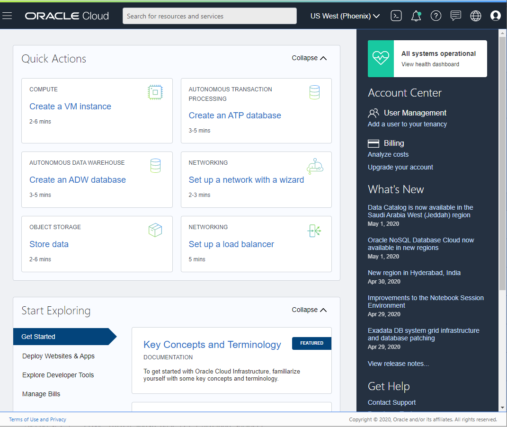

## Create a [compartment](https://docs.cloud.oracle.com/iaas/Content/Identity/Tasks/managingcompartments.htm)  
Compartments are useful when you want to organize and isolate your cloud resources.  Create a compartment for the objects used in this lab.
1. Click the menu icon in the upper left corner.
1. Scroll to the bottom, under Identity, click "Compartments".
   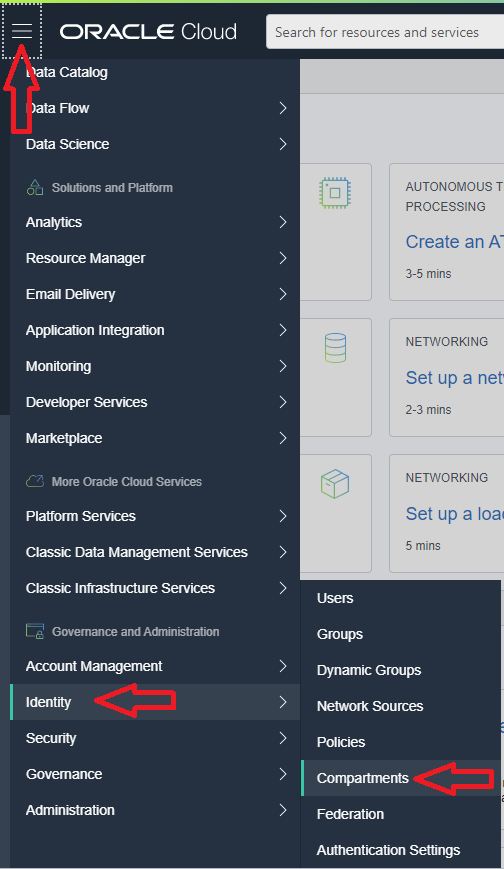
1. Click "Create Compartment".  
   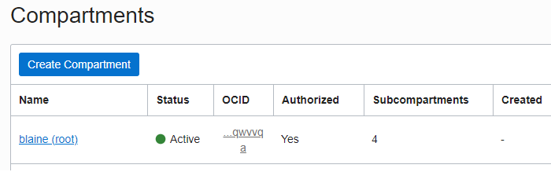
1. Populate the Name and Description.
1. Leave the parent compartment set to (root).
1. Click "Create Compartment"  
   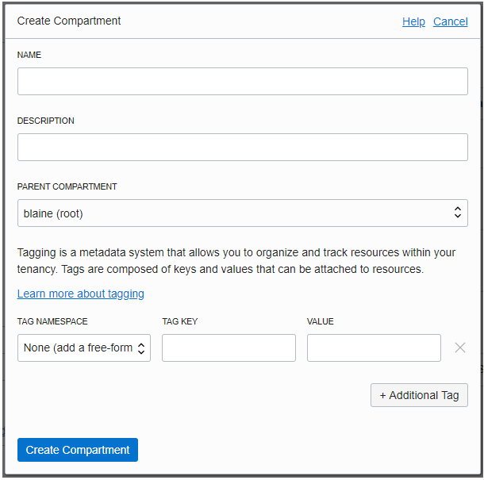
1. Click the "Oracle Cloud" logo to return to the dashboard.

## Create an ATP instance
You will need a database to complete the exercises.  An Oracle Autonomous Database handles a lot of the background admin tasks for you so you can focus on your project.
1. Click "Create an ATP database" in the Autonomous Transaction Processing box.  
   
1. Choose your new compartment.
1. Enter ```MyAtpDb``` in Display name
1. Enter  ```MyAtpDb``` in Database name
1. Make sure "Transaction Processing" is selected.
1. Make sure "Shared Infrastructure" is selected.  
   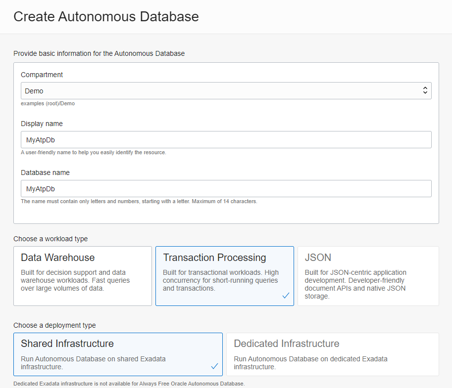
1. Scroll down to "Create administrator credentials".  Enter and confirm the ADMIN password.  
   **Note:**  the Admin account is the top level user for your new database.  Create a strong password and keep it secure.
1. Scroll to the bottom and click "Create Autonomous Database".  
   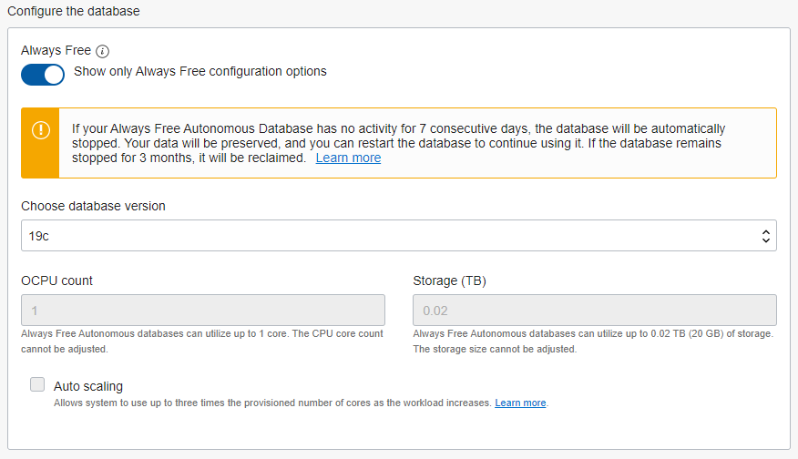  
   You will receive an email when your new ATP Database instance has been provisioned.
1. Locate your new database's OCID and click Copy.
     

## Cloud Shell
Click on the Cloud Shell icon.  
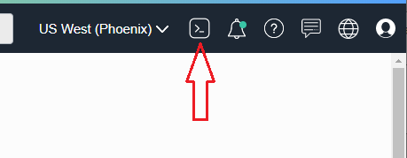  
This will open a preconfigured VM that you will use to access and setup your project.

### Working in the Oracle Cloud Shell
* The instructions in this lab use nano to edit files.  (You are welcome to use another editor if you prefer.)  
When instructed to save a file in nano do the following.
   1. Ctrl-X
   1. Y
   1. Enter 
* When using nano in the cloud shell use ```Ctrl-Shift-V``` or ```Shift-Insert``` to paste, rather than ```Ctrl-V```.
* At times you will be asked to use Git to add/commit/push your changes.  Use the following commands.  
```
git add .
git commit -m"enter your commit message here"
git push
```

### Create an environment variable for your Database OCID
Once the Cloud Shell is running, create an environment variable for your Database OCID you copied above.

```
export DB_OCID=<pasteYourOCIDhere>
```
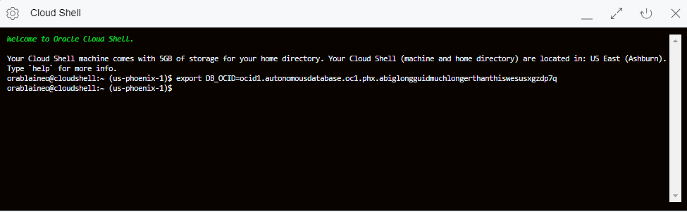  

The Oracle Autonomous Database uses an extra level of security in the form of a wallet containing access keys for your new Database.  

Once your ATP Database status is Available (the yellow box turns green) you can download the wallet inside the Cloud Shell using the pre-configured [OCI-CLI](https://docs.cloud.oracle.com/en-us/iaas/Content/API/Concepts/cliconcepts.htm).

You should change the password value in this command to something more secure.  
**Note:** This password is for the .zip file, not your database. 

In your **Cloud Shell** enter the following.
```
oci db autonomous-database generate-wallet --autonomous-database-id ${DB_OCID} --password Pw4ZipFile --file ~/Wallet_MyAtpDb.zip
```

### Open SQLDeveloper Web
Later, after everything is setup, you will use SQLDeveloper Web to access your database.

1. Click Tools
1. In the SQL Developer Web box, click the "Open SQL Developer Web" button  
   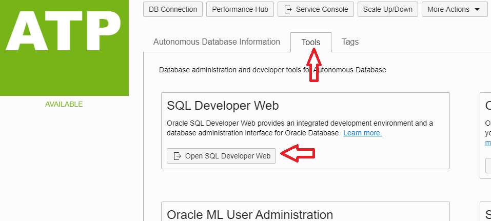  
   This will open SQL Developer Web in a new browser tab.
1. Log in as admin using the admin password you created for your Database.  
   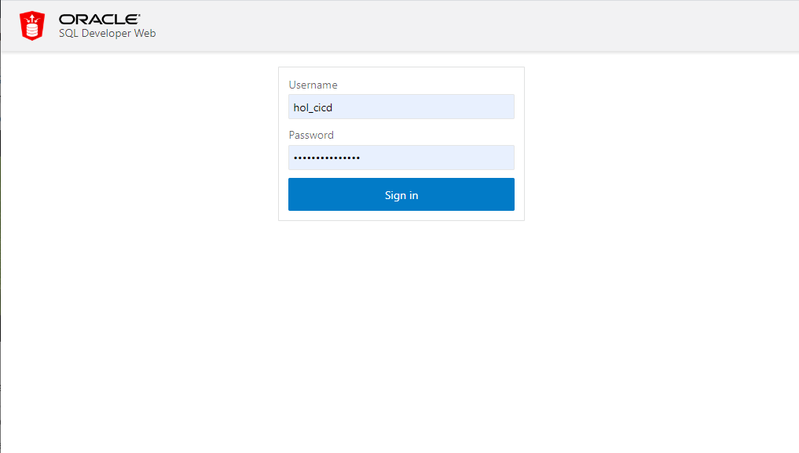  
   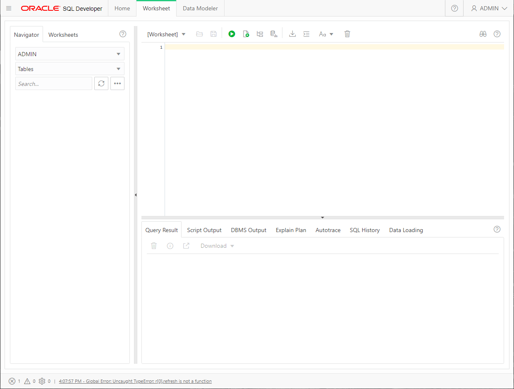  
1. Switch back to the Oracle Cloud browser tab.

Click the "Oracle Cloud" logo on the left of the menu bar to return to the dashboard.

## Create a Compute instance
An Oracle Compute instance is a Cloud VM that you will use to install and run all of the software for the lab.  
1. Click "Create a VM instance" in the Compute box.
   
1. Populate the name or keep the default.
   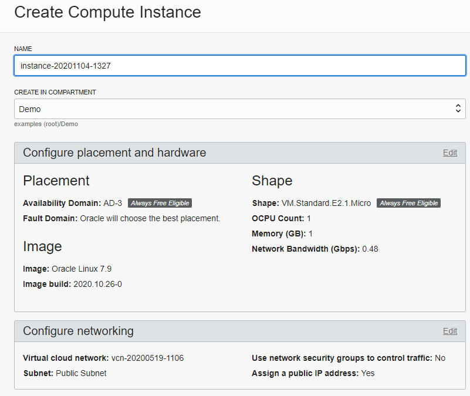
1. Scroll down the the "Add SSH keys" section.
1. Select "Paste SSH keys".
1. In your **Cloud Shell**
   1. Generate a new RSA key pair.
      ```
      ssh-keygen -t rsa -N "" -b 2048 -C "cloud_shell" -f ~/.ssh/id_rsa
      ```
   1. Display the public key and copy it.
      ```
      cat ~/.ssh/id_rsa.pub
      ```
1. In the Create Compute form, paste the public key in the SSH KEYS box.
   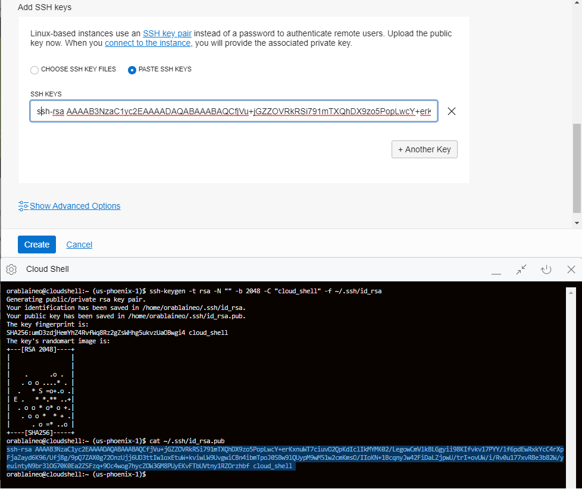
   If you intend to SSH into your compute instance from any other machine, you may click the "+ Another Key" button and enter the public key for that machine.  
   (you may also want to save a copy of the Cloud Shell private key '~/.ssh/id_rsa' on your local machine.  DO NOT SHARE your private key, this key allows access to your compute instance.)
1. Click "Create".
1. Once the Compute instance is Running, locate the Public IP Address and click Copy.  
Keep this IP address handy, it will be used throughout the lab and referred to as \<YourPublicIP>.
1. In your **Cloud Shell**, create an environment variable to store the IP.
   ```
   export COMPUTE_IP=<YourPublicIP>
   ```
   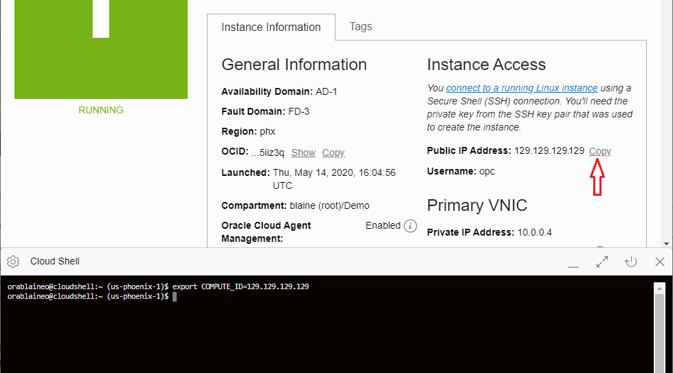

1. Next, you will open ports 8080 and 8000 in your cloud Virtual Network (VNIC).
   1. Click "Public Subnet"
      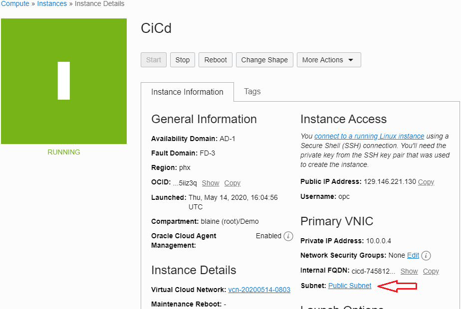
   1. Click the Security List name.  
      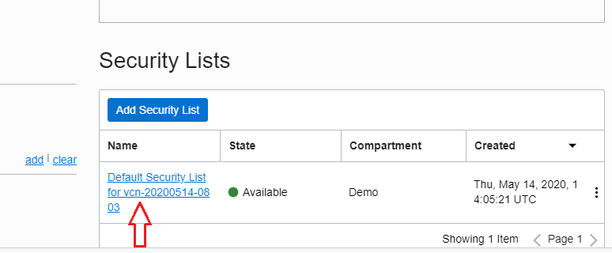  
   1. Click Add Ingress Rule.  
      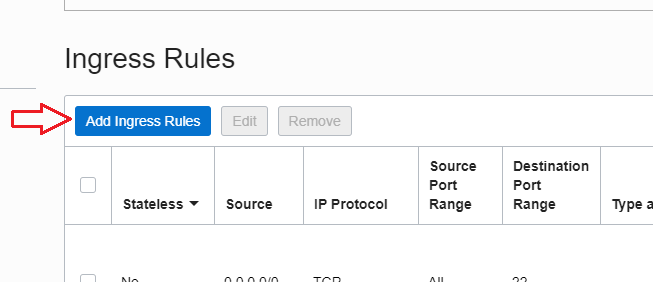  
   1. In the SOURCE CIDR box enter
      ```
      0.0.0.0/0
      ```
   1. In the DESTINATION PORT RANGE box enter
      ```
      8080
      ```
   1. Click Add Ingress Rule.
      
   1. Repeat for port 8000.

   **Be Aware**  
   **This will open ports 8080 8000 for any instance using the default security list**  

1. In your **Cloud Shell**  
   Use SCP to upload the wallet .zip file (downloaded earlier) to new Compute instance.
   ```
   scp Wallet_MyAtpDb.zip opc@${COMPUTE_IP}:/home/opc/
   ```
   

1. Maximize the Cloud Shell.
1. Use SSH to access your Compute instance from the Cloud Shell.
   ```
   ssh opc@${COMPUTE_IP}
   ```
   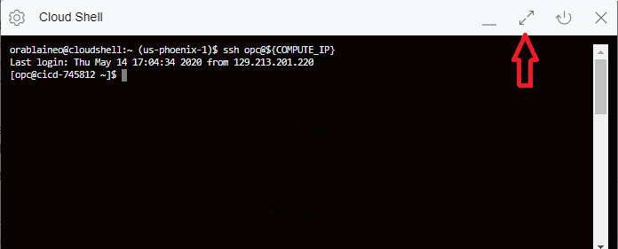  
**Note:** After this, any steps to be completed in your **Cloud Shell**, **Cloud Shell (ssh)** or in your **Compute Instance**, will be completed in the ssh session.
You can tell which instance you are connected to by looking at the prompt.
* ```<user>@cloudshell:``` is in the cloud shell but **not** the ssh session.
* ```[opc@<yourComputeName> <dir>]``` is in the ssh session.  
If you lose your ssh connection, return to the above step and reconnect.  
Feel free to use your own ssh client if you prefer.

## Setup your Compute Instance
Add the software needed for the lab.

In your **Cloud Shell (ssh)**
### Install Git
```
sudo yum install -y git
git --version
```

### Setup the Database Wallet
```
sudo mkdir -p /opt/oracle/wallet
sudo mv Wallet_MyAtpDb.zip /opt/oracle/wallet/
sudo unzip /opt/oracle/wallet/Wallet_MyAtpDb.zip -d /opt/oracle/wallet/
echo 'export TNS_ADMIN=/opt/oracle/wallet/' >> ~/.bashrc
source ~/.bashrc
```
Newer versions of Oracles ojdbc driver make it much easier to access a database using the extra wallet security.  To enable these features, edit the wallet/ojdbc.properties file.
```
sudo nano /opt/oracle/wallet/ojdbc.properties
```
1. Comment line 2
1. Un-comment the last 4 lines that start with '#javax.net.ssl'
1. Replace <password_from_console> with the password you used when you downloaded the wallet .zip file.
   ```
   # Connection property while using Oracle wallets.
   # oracle.net.wallet_location=(SOURCE=(METHOD=FILE)(METHOD_DATA=(DIRECTORY=${TNS_ADMIN})))
   # FOLLOW THESE STEPS FOR USING JKS
   # (1) Uncomment the following properties to use JKS.
   # (2) Comment out the oracle.net.wallet_location property above
   # (3) Set the correct password for both trustStorePassword and keyStorePassword.
   # It's the password you specified when downloading the wallet from OCI Console or the Service Console.
   javax.net.ssl.trustStore=${TNS_ADMIN}/truststore.jks
   javax.net.ssl.trustStorePassword=Pw4ZipFile
   javax.net.ssl.keyStore=${TNS_ADMIN}/keystore.jks
   javax.net.ssl.keyStorePassword=Pw4ZipFile
   ```
1. Save the file

### Download the Oracle Database Driver ojdbc8.jar
```
sudo wget https://repo1.maven.org/maven2/com/oracle/ojdbc/ojdbc8/19.3.0.0/ojdbc8-19.3.0.0.jar -O /opt/oracle/ojdbc8.jar
```

### Install Java 8
```
sudo yum install -y --enablerepo=ol7_ociyum_config oci-included-release-el7
sudo yum install -y jdk1.8
java -version
```

### Install [SQLcl](https://www.oracle.com/database/technologies/appdev/sqlcl.html)
You will use SQLcl to execute some setup scripts from your Compute instance.  
```
sudo yum install -y sqlcl
alias sql="/opt/oracle/sqlcl/bin/sql"
sql -v
```

### Install [utPLSQL](https://github.com/utPLSQL/utPLSQL)
Download the utPLSQL testing framework
```
curl -LOk $(curl --silent https://api.github.com/repos/utPLSQL/utPLSQL/releases/latest | awk '/browser_download_url/ { print $2 }' | grep ".tar.gz\"" | sed 's/"//g')
```
Extract downloaded "tar.gz" file
```
tar xvzf utPLSQL.tar.gz 
```
Use SQLcl to install utPLSQL  
('XNtxj8eEgA6X6b6f' is the default utPLSQL password.  You should change it.)
```
sql admin/notMyPassword@MyAtpDb_TP @utPLSQL/source/install_headless_with_trigger.sql ut3 XNtxj8eEgA6X6b6f DATA
```

### Install [utPLSQL-cli](https://github.com/utPLSQL/utPLSQL-cli)
utPLSQL-cli is a Java command-line client for utPLSQL v3  
```
curl -LOk $(curl --silent https://api.github.com/repos/utPLSQL/utPLSQL-cli/releases/latest | awk '/browser_download_url/ { print $2 }' | grep ".zip\"" | sed 's/"//g')
sudo unzip utPLSQL-cli.zip -d /opt/ && sudo chmod -R u+x /opt/utPLSQL-cli
sudo cp /opt/oracle/ojdbc8.jar /opt/utPLSQL-cli/lib
```

### Install [Liquibase](https://github.com/liquibase/liquibase)
Liquibase is a schema migration tool you will use to make changes to your database
```
wget https://github.com/liquibase/liquibase/releases/download/liquibase-parent-3.6.3/liquibase-3.6.3-bin.tar.gz
sudo mkdir /opt/liquibase
sudo tar xvzf liquibase-3.6.3-bin.tar.gz -C /opt/liquibase/
echo 'export PATH=$PATH:/opt/liquibase' >> ~/.bashrc
source ~/.bashrc
liquibase --version
```

### Install [Jenkins](https://www.jenkins.io/)
Jenkins is an automation server you will use to build and deploy your project
```
sudo wget -O /etc/yum.repos.d/jenkins.repo https://pkg.jenkins.io/redhat/jenkins.repo
sudo rpm --import https://pkg.jenkins.io/redhat/jenkins.io.key

sudo wget -O /etc/yum.repos.d/jenkins.repo https://pkg.jenkins.io/redhat/jenkins.repo
sudo rpm --import https://pkg.jenkins.io/redhat/jenkins.io.key

sudo yum install -y jenkins

sudo systemctl start jenkins
sudo systemctl status jenkins
sudo systemctl enable jenkins
```

### Open ports 8080 and 8000 in your compute instance's internal firewall
```
sudo firewall-cmd --permanent --zone=public --add-port=8080/tcp
sudo firewall-cmd --permanent --zone=public --add-port=8000/tcp
sudo firewall-cmd --reload
```

### Generate an rsa key pair in your compute instance
This rsa key pair will be used to access your GitHub repository from the compute instance.  
(This is a different key than the one used in your Cloud Shell to access this compute instance.)
1. Generate a new RSA key pair
   ```
   ssh-keygen -t rsa -N "" -b 2048 -C "CiCd-Compute-Instance" -f ~/.ssh/id_rsa
   ```
1. Display the public key, copy it and save it for the GitHub step below.
   ```
   cat ~/.ssh/id_rsa.pub
   ```

### Setup GitHub repository
1. **In your browser**  
   Go to https://github.com/OsBlaineOra/db-devops-tools
1. Click the 'Fork' button  
   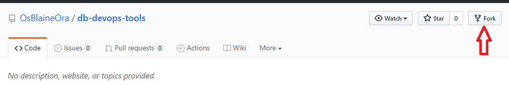  
1. **In your new repository**  
   Click Settings  
   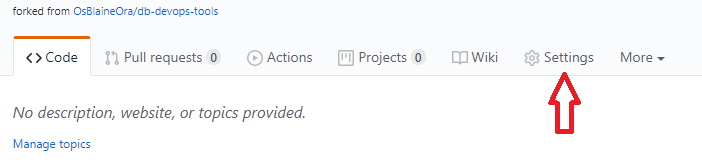  
1. Add your public key
   1. On the left, click 'Deploy keys'
   1. Click the 'Add deploy key' button  
   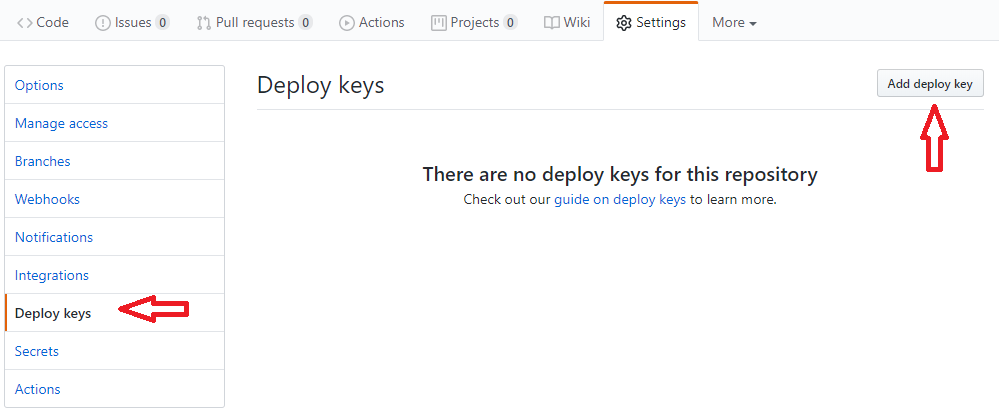  
   1. Enter a title for your key 'HoL Compute Instance'
   1. In the 'Key' field, past the public key you generated for this compute instance.
   1. Check 'Allow write access'
   1. Click 'Add key'  
   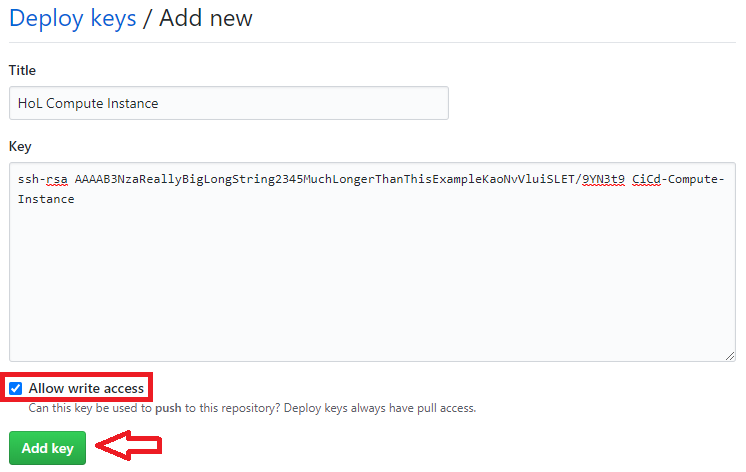  
1. Add a Webhook
   1. On the left, click 'Webhooks'
   1. Click the Add webhook button  
   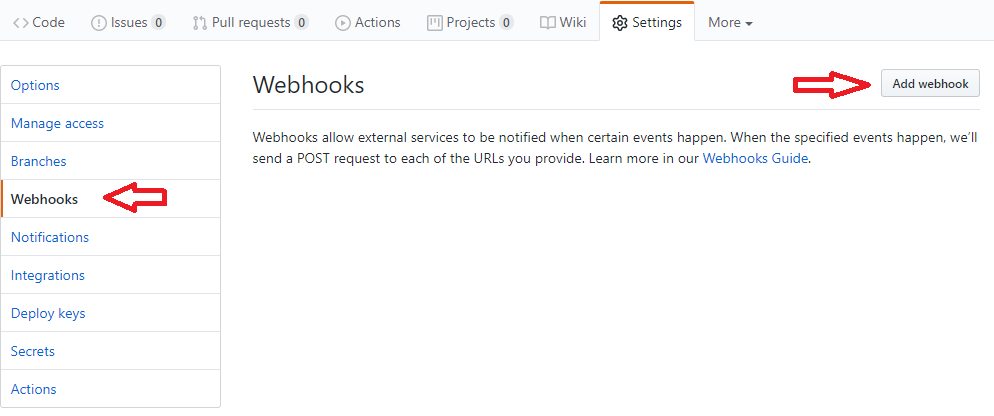  
   (You may be asked to re-enter your GitHub password)
   1. Use your Compute instance public IP to populate the Payload URL
      ```
      http://<YourPublicIP>:8080/github-webhook/
      ```
   1. Click the Add webhook button. (Ignore the error for now)  
   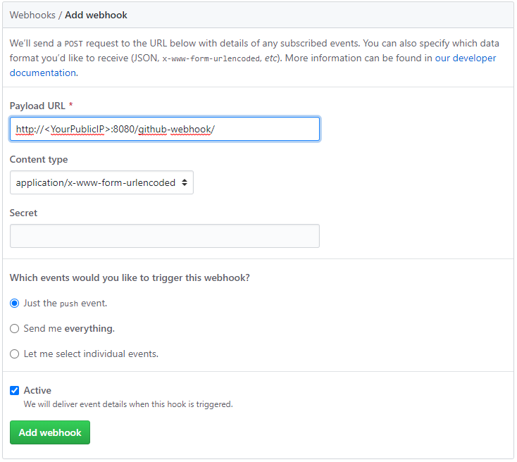  
1. Click the 'Code' tab
1. Click the 'Clone or download' button
1. If it doesn't say 'Clone with SSH' click the 'Use SSH' link
1. Click the button with a clipboard icon next to the clone string to copy it  
   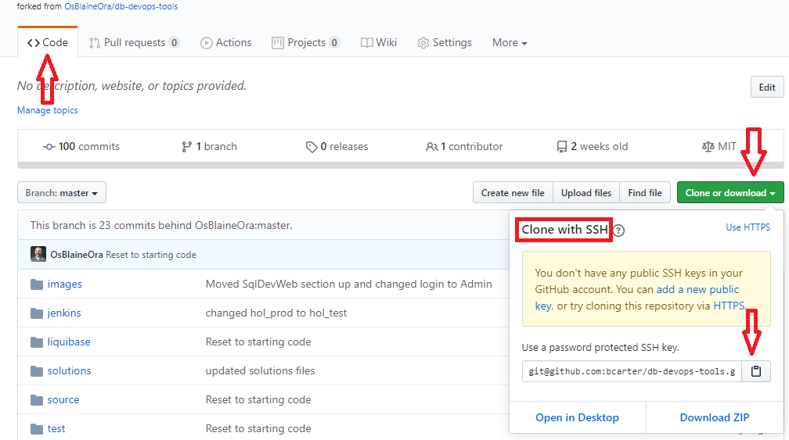  
1. In your **Cloud Shell(ssh)**  
   Clone your new Git repository
   ```
   git clone <The SSH string copied above>
   cd db-devops-tools
   ```
1. Use SQLcl to create the database schemas
   ```
   sql admin/notMyPassword@MyAtpDb_TP @create_schema.sql
   ```

## Continue through the following sections
1. Setup [Jenkins](Jenkins.md)
1. Schema Migration with [Liquibase](Liquibase.md)
1. Unit test your Database code with [utPLSQL](UTPLSQL.md)

## Want to Learn More?
* [Oracle Cloud](http://www.oracle.com/cloud/free)
* [Jenkins](https://www.jenkins.io/)
* [Liquibase](https://github.com/liquibase/liquibase)
* [utPLSQL](https://github.com/utPLSQL/utPLSQL)