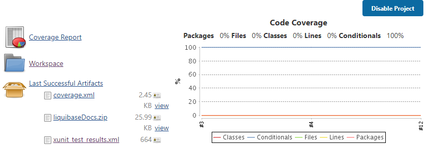

# utPLSQL
[utPLSQL](https://github.com/utPLSQL/utPLSQL) is a Unit Testing framework for Oracle PL/SQL and SQL.

## Standard Instructions
Throughout this section you will see the following instruction links  

[Liquibase Update][LbUpdateLink]

[LbUpdateLink]: UTPLSQL.md#liquibase-update "Run the following in your Cloud Shell(ssh)
cd ~/db-devops-tools/liquibase
liquibase --contexts=test update
cd ~/db-devops-tools"  

[Run Tests Locally][RunTestsLink]

[RunTestsLink]: UTPLSQL.md#Run-Tests-Locally "Run the following in your Cloud Shell(ssh)
/opt/utPLSQL-cli/bin/utplsql run hol_dev/HandsOnLabUser1@MyAtpDb_TP?TNS_ADMIN=/opt/oracle/wallet \
    -f=ut_coverage_html_reporter -o=coverage.html \
    -f=ut_documentation_reporter -c"

[Git add/commit/push][GitLink]  

[GitLink]: UTPLSQL.md#Git-Add-Commit-Push "Run the following in your Cloud Shell(ssh)
cd ~/db-devops-tools
git add .
git commit -m\"your commit message\"
git push"  

You may click the links to return to the below instructions, if you would like to copy and paste the commands.  
You may also hover the links to see the commands displayed in the popup text.

### Liquibase Update
Run the following in your **Cloud Shell(ssh)**
```
cd ~/db-devops-tools/liquibase
liquibase --contexts=test update
cd ~/db-devops-tools
```

### Run Tests Locally
Run the following in your **Cloud Shell(ssh)**
```
/opt/utPLSQL-cli/bin/utplsql run hol_dev/HandsOnLabUser1@MyAtpDb_TP?TNS_ADMIN=/opt/oracle/wallet \
    -f=ut_coverage_html_reporter -o=coverage.html \
    -f=ut_documentation_reporter -c
```

### Git Add Commit Push
Run the following in your **Cloud Shell(ssh)**
```
cd ~/db-devops-tools
git add .
git commit -m"your commit message"
git push
```

## Test package
For this exercise you will be creating a package of tests to test the generate_customers function.

Review the function  
Run the following in your **Cloud Shell(ssh)**
```
cat source/gen_cust.fnc
```

Review the test package specification
```
cat test/test_generate_customers_func.pks
```

utPLSQL uses annotations to define the unit tests.  

```-- %suite(Generate Customers function)``` declares that this is a test suite named "Generate Customers function"  

```-- %suitepath(generate_customers)``` is used to define the path to the unit being tested.  In this case it is a single stored function "generate_customers".  If you were testing a function inside of a package you could declare the path all the way from the schema to the function  
```-- %suitepath(my_schema.the_package.a_function)```.  Use a path definition that makes sense for your project.  

The function that you will be testing inserts data and executes a commit.  You will need to manually rollback the test data and use ```-- %rollback(manual)``` so that utPLSQL will not attempt to control the rollbacks.  

A placeholder test that always passes has been included.
```
  -- %test(Placeholder Test)
  procedure always_pass;
```
The ```-- %test(<Test Name>)``` annotation declares that the following procedure is a test.

Review the test package body
```
cat test/test_generate_customers_func.pkb
```

The placeholder test procedure creates a boolean variable set to true and tests to see if it's true.  This will always pass.
```
 procedure always_pass is
    l_is_true boolean := true;
  begin
    ut.expect( l_is_true ).to_be_true();
  end;
```

## Test Coverage
In your Jenkins project page, you will see a "Code Coverage" graph on the right hand side.  
  

The current code coverage is 0%.

Your Jenkins build is already configured to generate a Cobertura style coverage report by including the following parameters to the utPLSQL-cli call.

```
-f=ut_coverage_cobertura_reporter -o=coverage.xml \
```

There are other [coverage reporters](http://utplsql.org/utPLSQL/latest/userguide/coverage.html "utPLSQL code coverage documentation") available including an "HTML Reporter".  The HTML reporter will generate a dynamic web page to display your code coverage.
```
-f=ut_coverage_html_reporter -o=coverage.html \
```

## Create a real test
Edit the package spec  
Run the following in your **Cloud Shell(ssh)**
```
nano test/test_generate_customers_func.pks
```
Replace the lines
```
  -- %test(Placeholder Test)
  procedure always_pass;
```
With the following
```
  -- %test(Generates all requested)
  procedure gen_all;
```

Edit the package body
```
nano test/test_generate_customers_func.pkb
```
Replace the lines
```
 procedure always_pass is
    l_is_true boolean := true;
  begin
    ut.expect( l_is_true ).to_be_true();
  end;
```
With the following
```
  procedure gen_all is
  begin
    ut.expect( generate_customers( 20 ) ).to_( equal(20) );
  end;
```
In this test you are telling utPLSQL (ut) to expect that when you call the generate_customers function passing in 20 that it will return 20.

1. [Liquibase Update][LbUpdateLink]
1. [Run Tests Locally][RunTestsLink]
1. Review the output to see that the test passed on Dev
1. Start Web Server
    ```
    pushd /home/opc/db-devops-tools; python -m SimpleHTTPServer; popd
    ```
1. **In your browser**  
    Check Dev code coverage \<yourPublicIp>:8000/coverage.html
1. In your **Cloud Shell(ssh)**  
    Ctrl-C to stop the web server
1. [Git add/commit/push][GitLink]
1. **In Jenkins**  
    1. Check test results
    1. Check code coverage
    1. Click 'Build Now' to run the build a second time  
      The test Fails because the previous test data is still there.
1. **In SQL Developer Web**  
    Execute the following query in the worksheet to query the customers
    ```
    select * from hol_test.customers;
    ```

## Before All
Add a 'Before All' annotation to your test package to make sure the test environment is setup correctly before running any tests.

Edit the package spec  
Run the following in your **Cloud Shell(ssh)**
```
nano test/test_generate_customers_func.pks
```
Add the following between the ```-- %rollback(manual)``` and ```-- %test(Generates all requested)``` lines
```
  -- %beforeall
  procedure delete_added_customers;
```
Edit the package body
```
nano test/test_generate_customers_func.pkb
```
Add the following before the line ```procedure gen_all is```

```
  procedure delete_added_customers is
  begin
    delete from customers
    where name like 'custxxx%';

    commit;
  end;
```

The helper procedure, "delete_added_customers", is used to clean up the customer records generated by the function.  In this case you are calling it before any tests are run to make sure any 'test customers' have been removed and you start with a fresh environment.

1. [Git add/commit/push][GitLink]
1. **In Jenkins**  
    1. Check the test results.  This time it passed.  
    The before_all setup procedure sets up the environment so that it only contains the two "test" records created by the liquibase insert test data step.
    1. Check code coverage
        The coverage should now be at 80%.

## Add a test for requesting more than the limit.
Edit the package spec
```
nano test/test_generate_customers_func.pks
```
Add the following before the end of the package
```
  -- %test(Generates up to the limit)
  procedure gen_to_limit;
```
Edit the package body
```
nano test/test_generate_customers_func.pkb
```
Add the following before the end of the package
```
  procedure gen_to_limit is
  begin
    ut.expect( generate_customers( 30 ) ).to_( equal(23) );
  end;
```

1. [Git add/commit/push][GitLink]
1. **In Jenkins**  
    Check the test results.  The new test fails.  3 new customers were created but it was expecting 23.  
    This is because the data was not cleaned up after the previous test ran.  The before_all setup procedure is only run once before all tests run.

## Before each
Call the clean up procedure before each test is run.

Edit the package spec  
Run the following in your **Cloud Shell(ssh)**
```
nano test/test_generate_customers_func.pks
```
Add `--% beforeeach` after the `--% beforeall` annotation
  ```  
    --% beforeall
    --% beforeeach
    procedure delete_added_customers;
  ```
  This will call the cleanup procedure before each test is run.  
  Alternatively, you could make it a ```--% aftereach``` and have it clean up after each test runs.  But then you wouldn't be as sure that the environment was ready before each test is run.  
  Notice, if multiple annotations are performing the same action, you can stack the annotations and the same procedure will be called for each annotation.  
1. [Git add/commit/push][GitLink]
1. **In Jenkins**  
    1. Check the test results.  Both tests should now pass.
    1. Check coverage.  The coverage should now be at 86.67%.

## After all
Run the following query in a **SQL Developer Web** worksheet.
```sql
select * from hol_dev.customers;
```

The test customers are still there after the last test ran.

It's a good idea to clean up when your tests are complete.  You should try and leave the environment the way you found it when you got there.

Edit the package spec  
Run the following in your **Cloud Shell(ssh)**
```
nano test/test_generate_customers_func.pks
```
Add `--% afterall` after the `--% beforeeach` annotation
  ```  
    --% beforeall
    --% beforeeach
    --% afterall
    procedure delete_added_customers;
  ```

[Liquibase Update][LbUpdateLink] 

[Run Tests Locally][RunTestsLink]


Run the following query in a **SQL Developer Web** worksheet.
```sql
select * from hol_dev.customers;
```

The test customers should be removed.

[Git add/commit/push][GitLink]

In your browser open the Jenkins tab (You may need to refresh)
* Check test results
* Check code coverage

## Already over the limit
Add a test to make sure that no new customers are created if you are already over the limit.

Edit the package spec  
Run the following in your **Cloud Shell(ssh)**
```
nano test/test_generate_customers_func.pks
```
Add the following before the end of the package
```
  -- %test(Already at the limit, Generates 0)
  procedure over_limit;
```
Edit the package body
```
nano test/test_generate_customers_func.pkb
```
Add the following before the end of the package
```
  procedure over_limit is
    new_name varchar2(200);
  begin
    ut.expect( generate_customers( 30 ) ).to_( equal(0) );
  end;
```

1. [Git add/commit/push][GitLink]
1. **In Jenkins**  
    Check the test results.  The new test fails.  
    Since the 'before each' procedure is working there is still room to generate new customers before the limit.  You will need to add a little setup code to your test to make sure there are more customers than the limit before running the test.  

### Add setup to test
Add some code to insert 30 customers before running the test.  

Edit the package body  
Run the following in your **Cloud Shell(ssh)**
```
nano test/test_generate_customers_func.pkb
```
Add the following before the ```ut.expect(...``` line
```
    FOR counter IN 1 .. 30 LOOP
        new_name := 'custxxxTestOL' || counter || ' ' || CURRENT_TIMESTAMP;
        INSERT INTO customers (
        name,
        email
        ) VALUES (
        new_name,
        translate(new_name, ' ', '.') ||'@example.com'
        );
    END LOOP;
```
This will create 30 new customers in the table before the test is run.
1. [Git add/commit/push][GitLink]
1. **In Jenkins**
    1. Check results, all 3 tests should now pass.
    1. Check coverage, the coverage should now be at 93.33%.

## Test for null in 0 out
To get coverage for the remaining lines you need to test for a null in returning 0.

Edit the package spec  
Run the following in your **Cloud Shell(ssh)**
```
nano test/test_generate_customers_func.pks
```
Add the following before the end of the package
```
  -- %test(Returns 0 for null input)
  procedure null_amount;
```
Edit the package body
```
nano test/test_generate_customers_func.pkb
```
Add the following before the end of the package
```
  procedure null_amount is
  begin
    ut.expect( generate_customers( null ) ).to_( equal(0) );
  end;
```

1. [Git add/commit/push][GitLink]
1. **In Jenkins**
    1. Check results, all 4 tests should pass.
    1. Check coverage, the coverage should now be at 100%.

## Changing code covered by an existing test
A change request has come in.  The user would like the function to return null when a null is passed in.  
It is good practice to setup your tests so they test for what you want the code to do, before changing the function code.  

Edit the package spec  
Run the following in your **Cloud Shell(ssh)**
```
nano test/test_generate_customers_func.pks
```
Change the line
```
  -- %test(Returns 0 for null input)
```
To
```
  -- %test(Returns null for null input)
```
Edit the package body
```
nano test/test_generate_customers_func.pkb
```
Change the line
```
    ut.expect( generate_customers( null ) ).to_( equal(0) );
```
To
```
    ut.expect( generate_customers( null ) ).to_( be_null );
```

1. [Git add/commit/push][GitLink]
1. **In Jenkins**
    1. Check results, this test should now fail.

### Change the code to pass the test
Edit the function  
Run the following in your **Cloud Shell(ssh)**
```
nano source/gen_cust.fnc
```
Change the code
```
      IF amount is null then 
         Return 0;
      END IF;
```
To
```
      IF amount is null then 
         Return null;
      END IF;
```

1. [Git add/commit/push][GitLink]
1. **In Jenkins**
    1. Check results, all 4 tests should now pass.

## Test for Exceptions
Even though we have 100% code coverage, there is still at least one potential bug.  
If a user calls this function and passes in a non numeric value the function will throw an exception "numeric or value error".  Add a test to check for the expected exception.

Edit the package spec  
Run the following in your **Cloud Shell(ssh)**
```
nano test/test_generate_customers_func.pks
```
Add the following before the end of the package
```
  -- %test(Throws numeric or value error for non numeric input)  
  --% throws(-06502)
  procedure alpha_in;
```
You use the ```--% throws(<Exception number>)``` annotation to test for the exception number you expect to be thrown.  

Edit the package body
```
nano test/test_generate_customers_func.pkb
```
Add the following before the end of the package
```
  procedure alpha_in is
    created integer;
  begin
    created := generate_customers( 'x' );
  end;
```
In this test you're expecting an exception to be thrown so there will not be a value to test for.

1. [Git add/commit/push][GitLink]
1. Check results, all 5 tests should pass.
